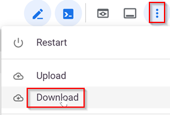
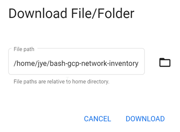

# bash-gcp-network-inventory
Bash script running in GCP Cloud Shell using gcloud to inventory VPC, Load balancer, VPN, Interconnect information


# Usage
- Launch GCP Cloud Shell
- run following command to download this repository
```
git clone https://github.com/jye-aviatrix/bash-gcp-network-inventory
```
- Switch directory to the inventory folder
```
cd bash-gcp-network-inventory/
```
- Run the invetory script
```
sh inventory.sh
```
- When prompted, enter project name, then hit enter
```
Provide GCP project name
my-project
```
- You may be prompted to authorize the Cloud Shell
- Wait until the script to complete, it will tell you a zip file is ready
```
/home/<username>/bash-gcp-network-inventory/<project_name>.zip is ready
```
- When completed for all projecs, in GCP Cloud Shell top right -> ... -> Download



- Switch to the bash-gcp-network-inventory folder and choose download



# Output Structure
Each information are exported in two formats: text and JSON. JSON may contain more detailed information, but text is more human readable.

For simplicity, I'm including only txt file in the structure below:

```
<project>
  |_ project.txt # Contains Project information such as Project ID
  |_ ips.txt # Reserved IP or IP ranges information for the entire project. Certain reservation dosn't belong to a VPC, hence placed here
  |_ target_pools.txt # Load balancer target pools of the project
  |_ backend_services.txt # Load balancer backend services of the project
  |_ cloud_routers.txt # Cloud Routers of the project
  |_ cloud_routers_<cr-name>_<cr-region>_dynamic_routes.txt  # Dynamic routes learned by Cloud Routers
  |_ vpn_tunnels.txt # VPN tunnels of the project
  |_ interconnects.txt # Interconnects of the project
  |_ vpc.txt # VPCs of the project
  |_ <vpc1>  # Subfolder of <vpc1>
    |_ subnets.txt # Subnets of <vpc1>
    |_ ips.txt  # IP reservations of <vpc1>
    |_ firewall.txt  # Firewall rules of <vpc1>
    |_ non_dynamic_routes.txt  # NON-dynamic Routes of <vpc1>, dynamic routes leared from Cloud Routers is recorded in cloud_routers_<cr-name>_<cr-region>_dynamic_routes.txt
    |_ peerings.txt # VPC peerings of <vpc1>
    |_ private_connections.txt # Private service connections that linked to reserved IP ranges for <vpc1>
  |_ <vpc2>  # Subfolder of <vpc2>
    |_ subnets.txt # Subnets of <vpc2>
    |_ ips.txt  # IP reservations of <vpc2>
    |_ firewall.txt  # Firewall rules of <vpc2>
    |_ non_dynamic_routes.txt  # NON-dyamic Routes of <vpc2>, dynamic routes leared from Cloud Routers is recorded in cloud_routers_<cr-name>_<cr-region>_dynamic_routes.txt
    |_ peerings.txt # VPC peerings of <vpc2>
    |_ private_connections.txt # Private service connections that linked to reserved IP ranges for <vpc2>
```
